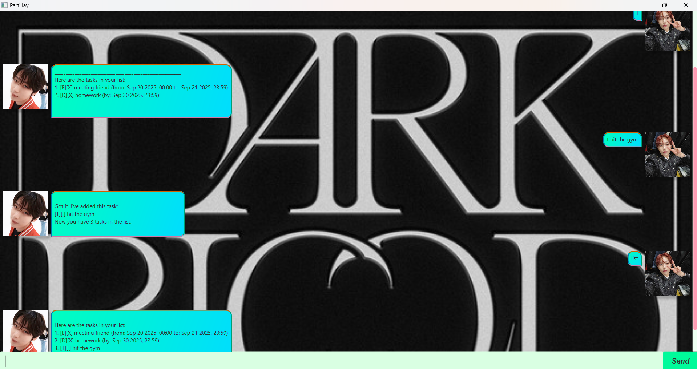

# Partillay User Guide



Compatible with Java 17 and above, this is a simple GUI application that simulates a chatbot helping users to manage their tasks.

## Quick start
1. Ensure you have Java `17` or above installed in your Computer.
2. Download the latest `.jar` file from [here](https://github.com/Partillay/ip/releases/tag/A-Jar2).
3. Copy the file to the folder you want to use as the_home folder_ for Partillay.
4. Open a command terminal, `cd` into the folder you put the jar file in, and use the `java -jar Partillay.jar` command to run the application. Double-click the jar file will also work.

## Accepted `DateTimeFormat`'s for Partillay:
```
YYYY_MM_DD_HH_MM_1("yyyy-MM-dd HH:mm"),
YYYY_MM_DD_HH_MM_2("yyyy/MM/dd HH:mm"),
YYYY_MM_DD_HH_MM_3("yyyy-MM-dd HHmm"),
YYYY_MM_DD_HH_MM_4("yyyy/MM/dd HHmm"),

YYYY_MM_DD_1("yyyy-MM-dd"),
YYYY_MM_DD_2("yyyy/MM/dd"),

D_MM_YYYY("d/MM/yyyy"),
DD_MM_YYYY("dd/MM/yyyy"),

DD_MM_YYYY_HH_MM_1("dd-MM-yyyy HH:mm"),
DD_MM_YYYY_HH_MM_2("dd/MM/yyyy HH:mm"),
DD_MM_YYYY_HH_MM_3("dd-MM-yyyy HHmm"),
DD_MM_YYYY_HH_MM_4("dd/MM/yyyy HHmm"),

YYYY_MM_DD_T_HH_MM("yyyy-MM-dd'T'HH:mm").
```

## Adding todos: `todo` and `t`
Adds todos, no time is needed.

Format:
1. `todo TASK`
2. `t TASK`

Examples:
1. `todo hit the gym`
2. `t cook dinner`

The chatbot will notify that the task is added, i.e.:
```
________________________________________________________
Got it. I've added this task:
[T][] hit the gym
Now you have 3 tasks in the list.
________________________________________________________
```
## Adding events: `event` and `e`
Adds tasks with start time and end time.
If `from` time is unspecified, it is set to `0000`. If `to` time is unspecified, it is set to `2359`.

Format:
1. `event TASK /from START_DATETIME /to END_DATETIME`
2. `e TASK /from START_DATETIME /to END_DATETIME`

Examples:
1. `event meeting /from 19/09/2027 1800 /to 19/09/2027 1959`
2. `e Jeju trip /from 2015/04/20 /to 2015/04/22`

## Adding deadlines: `deadline` and `dl`
Adds tasks with deadlines, if no time is specified, time is set to be 2359.

Format:
1. `deadline TASK /by DEADLINE_DATETIME`
2. `d TASK /by DEADLINE_DATETIME`

Examples:
1. `deadline submit homework /by 27/09/2027`
2. `dl meet with friend /by 2019/01/25`

The chatbot will notify that the task is added, i.e.:
```
________________________________________________________
Got it. I've added this task:
[D][] submit homework (by: Sep 27 2027, 23:59)
Now you have 4 tasks in the list.
________________________________________________________
```

## Searching tasks by description: `find` and `f`

Finds tasks of which descriptions contain the keywords.

Format: `find KEYWORD` or `f KEYWORD`
- The search is case-sensitive.
- Only the description is searched.
- Only full words will be matched.

## Listing tasks: `list` and `l`

Shows a list of all tasks in the current task list.

Format: `list` or `l`

## Deleting a task: `delete` and `d`

Deletes the specified task based on its index from the task list.

Format: `delete INDEX` or `d INDEX`
- Deletes the task at the specified `INDEX`.
- The index refers to the index number shown in the displayed task list.
- The index **must be a positive integer** 1,2,3,...

## Marking a task as done: `mark` and `m`

Marks a task as done based on its index from the task list.

Format: `mark INDEX` or `m INDEX`
- Marks the task at the specified `INDEX` as done.
- The index refers to the index number shown in the displayed task list.
- The index **must be a positive integer** 1,2,3,...
- Marked tasks can be marked again.

Example: `mark 3`

The chatbot will notify that the task is marked as done, i.e.:

```
________________________________________________________
Nice! I've marked this task as done:
[T][X] hit the gym
________________________________________________________
```

## Marking a task as not done: `unmark` and `u`

Marks a task as not done based on its index from the task list.

Format: `unmark INDEX` or `u INDEX`
- Marks the task at the specified `INDEX` as not done.
- The index refers to the index number shown in the displayed task list.
- The index **must be a positive integer** 1,2,3,...
- Unmarked tasks can be unmarked again.

Example: `unmark 3`

The chatbot will notify that the task is marked as not done, i.e.:

```
________________________________________________________
OK, I've marked this task as not done yet:
[T][] hit the gym
________________________________________________________
```

## Exiting the program: `bye` and `b`

Exits the program.

Format: `bye` or `b`